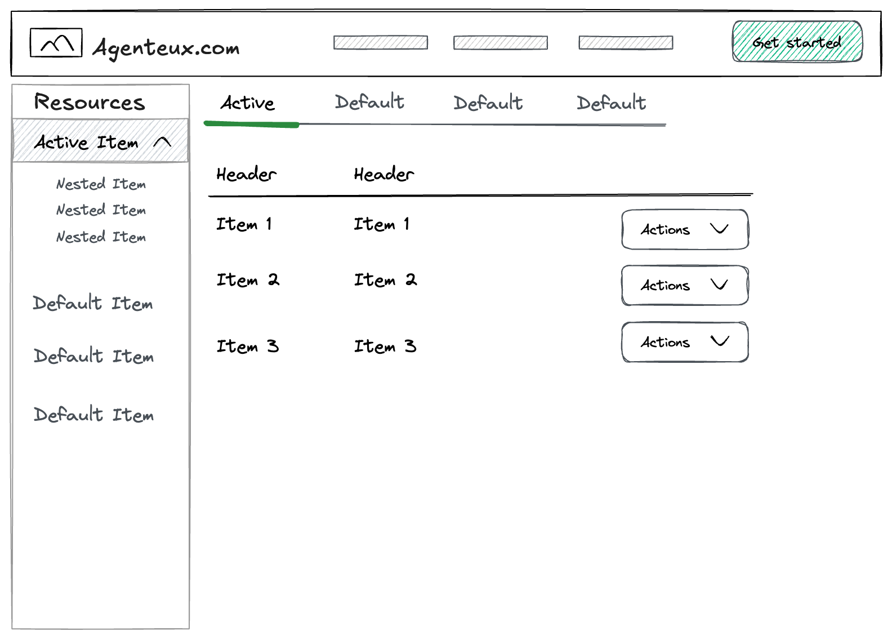

# Product Requirements Document: OpenAPI-Driven Web Administration Console

| Document Information | Detail |
| :--- | :--- |
| **Product Name** | OpenAPI-Driven Web Administration Console |
| **Version** | 1.0 |
| **Author** | Todd Fredrich |
| **Creation Date** | December 22, 2025 |
| **Status** | Draft/Initial Release |

---

## 1. Introduction

### 1.1. Goal and Vision

The primary goal of the OpenAPI-Driven Web Administration Console is to provide a framework to create a **minimal-configuration, no/low-code, multi-tenant administrative interface** for any API honoring the **Collection Metaphor** and exposes the API via an **OpenAPI Specification (OAS)** document (formerly Swagger).

The vision is to create a powerful, flexible, and maintainable tool that drastically reduces the development effort required to build and maintain administrative UIs for API-driven microservices and multi-tenant SaaS platforms. By dynamically generating the user interface (UI) at runtime based on the API contract, the console ensures that the UI is always synchronized with the backend API, eliminating common integration errors and maintenance overhead.

Ideally, the effort to create a new application using this framework is:
* Create a configuration file (e.g., console.json or console.yaml), in the project root directory, that maps left-hand nav menu items to paths in the OAS file.
* Include the referenced OAS file (e.g., openapi.json) that contains paths and schemas for the resources being managed.
* [FUTURE] The OAS could be dyamically loaded from the Internet if so configured in the configuration file.
* Run `npm run dev` to test the UI locally.
* Run `npm build` to generate static assets for deployment (e.g. on Cloudflare)

### 1.2. Target Audience

This PRD is intended for the following audiences:

*   **Product Management**: To define the scope, features, and success criteria.
*   **Engineering Team (Frontend & Backend)**: To guide the technical implementation and architecture.
*   **UX/UI Designers**: To understand the required user flows and dynamic design constraints.
*   **Stakeholders**: To approve the product direction and resource allocation.

### 1.3. Business Context

In a multi-tenant SaaS environment, rapid deployment and management of new services are critical. This Admin Console serves as a foundational tool to enable:
1.  **Accelerated Development**: Instantly provide a management interface for new services.
2.  **Reduced Maintenance**: The UI adapts automatically to API changes defined in the OAS.
3.  **Consistency**: Enforce a consistent user experience across all managed services.

---

## 2. Goals and Objectives

The Admin Console must achieve the following key objectives:

| ID | Objective | Description |
| :--- | :--- | :--- |
| **GOAL-01** | **Dynamic UI Generation** | The entire application interface (navigation, lists, forms) must be generated at runtime based on an OpenAPI Specification (OAS) file. NOTE: the API MUST follow the _Collection Metaphor_ pattern. |
| **GOAL-02** | **Full CRUD Support** | Provide complete Create, Read, Update, and Delete (CRUD) functionality for all exposed resources, driven by the HTTP methods (POST, GET, PUT, DELETE) defined in the OAS. |
| **GOAL-03** | **Configurable Navigation** | Allow developers (or product managers) to define the structure and content of the left-hand navigation menu via a simple, external JSON (or YAML) configuration file that maps menu items to OAS paths. |
| **GOAL-04** | **Secure Access** | Implement robust security mechanisms, including support for standard OAS security schemes (e.g., OAuth2, JWT), to ensure secure access to the managed APIs. |
| **GOAL-05** | **Multi-Tenant Ready** | The design must inherently support managing resources across different tenants, typically by passing a tenant identifier (e.g., in a header or path parameter). |
| **GOAL-06** | **Extensibility and Customization** | Provide hooks or extension points to allow for future enhancements, such as custom form components, validation rules, or additional UI features. |
| **GOAL-07** | **Opensource Stack** | The application must be built using open-source technologies and frameworks (e.g. React, Node.js) to ensure community support and maintainability. |
| **GOAL-08** | **CDN Deployment** | The application must be deployable to a CDN for fast, scalable delivery. |

---

## 3. User Experience (UX) and Design

The design is based on the provided mockup, emphasizing a clear, two-panel layout: a persistent left-hand navigation and a main content area. The design also includes a top header for branding and user actions as well as a dynamic tab bar for context switching between multiple open resources.



### 3.1. Information Architecture

The application will follow a standard master-detail pattern:

1.  **Header**: Displays the application title/logo and user actions (e.g., profile, logout).
1.  **Left Navigation**: Lists the available **Collection Resources** (e.g., `/users`, `/products`).
2.  **Main Content (Master View)**: Displays the list of resources within the selected collection.
3.  **Main Content (Detail View)**: Displays the details of a single resource.
4.  [FUTURE] **Tab Bar**: Within the main content area, allows switching between multiple open resource detail views.

### 3.2. Navigation Requirements (GOAL-03)

| Requirement ID | Description |
| :--- | :--- |
| **UX-NAV-01** | **Source of Truth**: The left-hand navigation menu must be populated based on an external JSON configuration file, not directly from the OAS file. |
| **UX-NAV-02** | **Mapping**: Each top-level or nested navigation item in the JSON config must map to a specific **collection path** in the OAS (e.g., `/v1/users`). |
| **UX-NAV-03** | **Nesting Support**: The JSON configuration must support arbitrary nesting of menu items to organize resources logically (as shown in the mockup with "Active Item" and "Nested Item"). |
| **UX-NAV-04** | **Active State**: The currently selected navigation item must be clearly highlighted (e.g., "Active Item" in the mockup). |

### 3.3. Collection View (Master List) Requirements (GOAL-02)

When a collection resource is selected from the navigation, the main content area displays a list of resources retrieved via a `GET` request to the corresponding collection path.

| Requirement ID | Description |
| :--- | :--- |
| **UX-LIST-01** | **Data Retrieval**: Execute a `GET` request to the collection path (e.g., `/v1/users`) and display the resulting array of objects in a table format. |
| **UX-LIST-02** | **Dynamic Headers**: Table headers must be dynamically determined from the schema of the resource object returned by the API. A configurable mechanism (e.g., in the JSON config) should allow specifying which fields to display and their order. |
| **UX-LIST-03** | **Search and Filtering (GOAL-05)**: The list must include a search bar that utilizes API query parameters for server-side searching/filtering, as defined by the OAS path parameters for the `GET` operation. |
| **UX-LIST-04** | **Pagination/Scrolling**: The list should support server-side pagination or infinite scrolling, utilizing query parameters (e.g., `limit`, `offset`, `page`) as defined in the OAS (Requirement 5). |
| **UX-LIST-05** | **Create Action**: If the OAS defines a `POST` operation on the collection path, a visible **`+` (plus) button** must be present to initiate the resource creation flow (Requirement 2.1). |
| **UX-LIST-06** | **Row Click (Read)**: Clicking anywhere on a table row must navigate to the **Resource Detail View** (Requirement 4). |
| **UX-LIST-07** | **Action Dropdown**: Each row must feature an "Actions" dropdown button (as shown in the mockup) that dynamically populates based on the methods available for the **single resource path** (e.g., `/v1/users/{userId}`). |

### 3.4. Resource Detail and Action Requirements (GOAL-02)

| Requirement ID | Description |
| :--- | :--- |
| **UX-DETAIL-01** | **Read-Only View**: The default view for a single resource must be a read-only display of all resource attributes, retrieved via a `GET` request to the single resource path (e.g., `/v1/users/{id}`). |
| **UX-DETAIL-02** | **Dynamic Action Menu**: The "Actions" dropdown (UX-LIST-07) must include: <br> - **Update**: If a `PUT` method is defined for the single resource path (Requirement 3.1). <br> - **Delete**: If a `DELETE` method is defined for the single resource path (Requirement 3.2). |
| **UX-DETAIL-03** | **Inline Edit Button**: A **pencil icon** must be displayed in the upper-right corner of the read-only detail view **only if** a `PUT` method is defined for the single resource path (Requirement 4). Clicking this icon must open the **Update Form**. |
| **UX-DETAIL-04** | **Delete Confirmation**: The Delete action must trigger a modal confirmation dialog before executing the `DELETE` API call (Requirement 3.2). |

### 3.5. Dynamic Form Requirements (GOAL-01)

Forms for creating (POST) and updating (PUT) resources must be dynamically generated.

| Requirement ID | Description |
| :--- | :--- |
| **UX-FORM-01** | **Schema Source**: Forms must be generated based on the request body schema defined in the corresponding `POST` (for Create) or `PUT` (for Update) operation in the OAS (Requirement 6).|
| **UX-FORM-02** | **Input Mapping**: The application must map OAS schema types to appropriate HTML form inputs: <br>`string` to text input <br> `integer` to number input <br> `boolean` to checkbox/toggle <br> `enum` to dropdown <br> `date` (`string` with `format: date`) to date/calendar input <br> `array` to multi-select or list input <br> Read-only properties (`readOnly: true`) must be displayed as read-only fields. |
| **UX-FORM-03** | **Validation**: Client-side validation must be dynamically applied based on OAS schema properties (e.g., `required`, `minLength`, `maxLength`, `pattern`, `format`). |
| **UX-FORM-04** | **Update Pre-population**: For the Update form (`PUT`), all fields must be pre-populated with the current resource data retrieved from the `GET` request (Requirement 3.1). |
| **UX-FORM-05** | **Field Visibility**: Configuration should allow for optional overrides to hide or re-label specific fields in the dynamically generated forms. |
| **UX-FORM-06** | **Submission Handling**: On form submission, the application must send the appropriate `POST` or `PUT` request with the form data serialized as JSON in the request body. Successful submissions must redirect back to the Collection View (for Create) or Resource Detail View (for Update). |
| **UX-FORM-07** | **Error Display**: Any validation errors returned from the API must be displayed inline within the form, clearly indicating which fields are affected. |
| **UX-FORM-08** | **Cancel Action**: Each form must include a "Cancel" button that discards changes and returns the user to the previous view without making any API calls. |
| **UX-FORM-09** | **Loading States**: The form must display appropriate loading indicators while fetching data for pre-population (Update) or submitting data to the API. |
| **UX-FORM-10** | **Accessibility**: All form elements must adhere to accessibility standards (e.g., proper labeling, keyboard navigation, ARIA attributes). |
| **UX-FORM-11** | **Responsive Design**: Forms must be fully responsive and usable on various screen sizes, including desktops, tablets, and mobile devices. |
| **UX-FORM-12** | **Custom Forms**: The application must support a mechanism for defining custom form layouts and components that can be applied to specific resources or fields, allowing for more complex UI requirements beyond the standard dynamic generation. |
| **UX-FORM-13** | **Multi-Step Forms**: For resources with a large number of fields, the application should support multi-step forms, breaking the form into manageable sections while maintaining data integrity across steps. |
| **UX-FORM-14** | **Form Component**: The application MAY use a form component library or framework to enhance the UI and user experience of dynamically generated forms. For example, React JSON Schema Form: https://react-jsonschema-form.readthedocs.io/en/v1.8.1/ |

---

## 4. Technical Requirements

### 4.1. OAS Ingestion and Parsing

| Requirement ID | Description |
| :--- | :--- |
| **TECH-OAS-01** | **Input Flexibility**: The console must be able to ingest the OAS file from two sources: a local file system path or a remote HTTP/HTTPS URL based on configuration. |
| **TECH-OAS-02** | **Version Support**: Must support OpenAPI Specification versions 3.0.x and 3.1.x. |
| **TECH-OAS-03** | **Parsing Engine**: An opensource, robust, performant OAS parsing library must be used to resolve all references (`$ref`) and flatten the schema for reliable UI generation. |
| **TECH-OAS-04** | **Path Matching Logic**: The application must implement logic to correctly match navigation paths (e.g., `/v1/users`) to collection operations and single resource paths (e.g., `/v1/users/{id}`). |
| **TECH-OAS-05** | **Method Detection**: The application must accurately detect and map HTTP methods (GET, POST, PUT, DELETE) to their corresponding UI actions based on the OAS definitions. |
| **TECH-OAS-06** | **Schema Extraction**: The application must extract request and response schemas for dynamic form generation and data display, ensuring all necessary fields and validation rules are captured. |
| **TECH-OAS-07** | **Parameter Handling**: The application must correctly interpret and utilize path, query, header, and cookie parameters as defined in the OAS for API requests. |
| **TECH-OAS-08** | **Error Resilience**: The OAS ingestion process must include error handling to gracefully manage invalid or unsupported OAS files, providing clear feedback to the user. |
| **TECH-OAS-09** | **Caching**: Implement caching mechanisms for the OAS file to minimize redundant network requests and improve performance, with cache invalidation strategies based on configuration. |

### 4.2. API Interaction and Data Handling

| Requirement ID | Description |
| :--- | :--- |
| **TECH-API-01** | **Base URL Configuration**: The base URL for all API calls must be configurable, overriding the `servers` object in the OAS if necessary (for multi-environment and/or multi-tenant support). |
| **TECH-API-02** | **Error Handling**: Must provide clear, user-friendly error messages for failed API calls (e.g., 4xx and 5xx responses), including displaying validation errors returned from the backend in the context of the dynamic forms. |
| **TECH-API-03** | **Request Headers**: The console must be able to dynamically inject necessary headers, such as `Authorization` (from security flow) and `X-Tenant-ID` (for multi-tenancy). |
| **TECH-API-04** | **Data Serialization**: All data sent to the API (e.g., in POST and PUT requests) must be serialized as JSON, adhering to the structure defined in the OAS schemas. |
| **TECH-API-05** | **Response Handling**: The application must correctly parse and utilize API responses, including handling pagination metadata if provided by the API. |
| **TECH-API-06** | **Timeouts and Retries**: Implement configurable timeouts and retry logic for API requests to enhance reliability in case of transient network issues. |
| **TECH-API-07** | **URL Parameters**: The application must correctly handle URL parameters (e.g., `/v1/users/{id}`) in API requests, ensuring they are properly substituted with values from the UI. |

### 4.3. Security and Authentication (GOAL-04)

The console must adhere to the security definitions within the OAS (Requirement 7).

| Requirement ID | Description |
| :--- | :--- |
| **TECH-SEC-01** | **OAS Security Scheme Support**: Must support the following OAS security schemes: `OAuth2` (Authorization Code Flow, Client Credentials Flow) and `HTTP` (Bearer/JWT). |
| **TECH-SEC-02** | **Token Acquisition**: For OAuth2/JWT schemes, the application must be configured with a `client_id` (and optionally a `client_secret`) to obtain an access token from a configured Authorization Server (AS). |
| **TECH-SEC-03** | **Token Refresh**: The application must implement logic to automatically refresh expired access tokens without requiring the user to re-authenticate, if a refresh token is available. |
| **TECH-SEC-04** | **Session Management**: The acquired tokens must be securely stored (e.g., in memory or secure cookies) and attached to all subsequent API requests via the `Authorization` header. |

---

## 5. Configuration File Specification

The application relies on a separate JSON/YAML configuration file to define the UI structure, decoupling it from the raw OAS structure.

### 5.1. Configuration File (`config.json` or `config.yaml`)

The configuration file must define the navigation structure and provide overrides for display logic.

| Field | Type | Description |
| :--- | :--- | :--- |
| `oas_source` | String | URL or local path to the OpenAPI Specification file. |
| `api_base_url` | String | Optional. Overrides the base URL defined in the OAS `servers` object. |
| `security_config` | Object | Configuration for security schemes (e.g., `client_id`, `auth_server_url`). |
| `navigation` | Array | Defines the structure of the left-hand menu. |

### 5.2. Navigation Array Structure

Each object in the `navigation` array represents a menu item.

| Field | Type | Description |
| :--- | :--- | :--- |
| `label` | String | The display name in the navigation menu (e.g., "Users"). |
| `path` | String | The OAS collection path (e.g., `/v1/users`). This path must support a `GET` operation. |
| `display_fields` | Array of Strings | Optional. List of field names to display as columns in the Collection View table. If omitted, the first few fields from the schema are used. An element labeled '*' indicates all (remaining) fields should be displayed. |
| `children` | Array | Optional. Recursively defines nested menu items. |

### Example `config.json` Snippet

```json
{
  "oas_source": "https://api.example.com/v1/openapi.json",
  "api_base_url": "https://api.tenant-a.com",
  "security_config": {
    "type": "oauth2",
    "client_id": "admin-console-client",
    "auth_url": "https://auth.example.com/oauth/authorize",
    "token_url": "https://auth.example.com/oauth/token"
  },
  "navigation": [
    {
      "label": "Resources",
      "path": "/v1/resources",
      "display_fields": ["id", "name", "status"]
    },
    {
      "label": "User Management",
      "children": [
        {
          "label": "Users",
          "path": "/v1/users",
          "display_fields": ["user_id", "email", "created_at"]
        },
        {
          "label": "Roles",
          "path": "/v1/roles",
          "display_fields": ["role_id", "name"]
        }
      ]
    }
  ]
}
```

---
## 6. Technical Stack

The Admin Console will be built using the following open-source technologies:

*   **Frontend**: React.js with TypeScript
*   **Backend**: None as it accesses already existing APIs
*   **OAS Parsing**: `swagger-parser` or `openapi-typescript`
*   **State Management**: Redux Toolkit or Context API
*   **UI Components**: Material UI or Tailwind CSS
*   **API Client**: Axios or Fetch API
*   **Configuration Management**: JSON/YAML parsing libraries (e.g., `yaml` or `json5`)
*   **Security**: OAuth2/OIDC libraries (e.g., `passport-oauth2`, `oidc-client-js`)
*   **Deployment**: CDN deployment capabilities

---

## 7. Success Metrics

The success of the Admin Console will be measured by the following metrics:

| Metric | Definition | Target |
| :--- | :--- | :--- |
| **OAS Compatibility Rate** | Percentage of valid OAS files (v3.0/3.1) that can be successfully parsed and rendered without manual intervention. | > 95% |
| **Time-to-Admin-Interface** | Time taken from providing a new OAS file to having a fully functional CRUD interface. | < 5 minutes |
| **Feature Coverage** | Percentage of defined OAS methods (GET, POST, PUT, DELETE) that are correctly translated into UI functionality. | 100% |
| **Configuration Simplicity** | Average number of lines in the `config.json` required per resource path. | Minimal, focused only on display overrides. |

---

## 8. Future Considerations (Out of Scope for V1)

The following items are noted as potential future enhancements but are explicitly **out of scope** for the initial release:

*   **Custom UI Components**: Support for custom React/Vue components to override dynamically generated form fields (e.g., a rich text editor instead of a standard text area).
*   **Webhooks/Event Subscriptions**: Displaying real-time updates or logs based on API webhooks.
*   **Advanced Filtering**: UI components for complex, multi-field filtering beyond simple search.
*   **OAS Extensions**: Support for custom OpenAPI extensions (e.g., `x-admin-ui-label`) to further customize the UI directly within the OAS file.
*   **Role-Based Access Control (RBAC)**: Fine-grained UI control based on user roles and OAS security scopes.

---
**End of Document**
